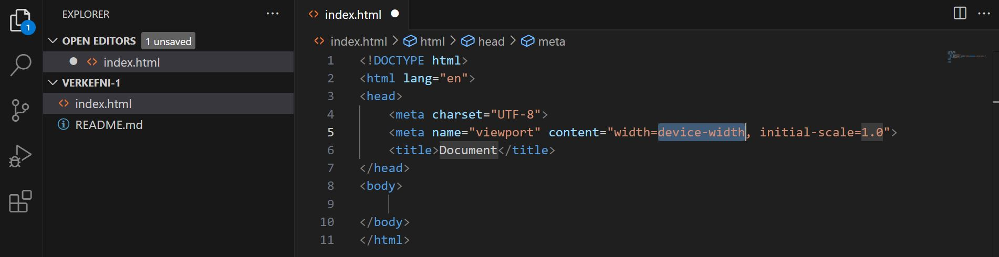

# HTML og CSS 

### Markmið:
Nemendur
- stofna vefumsjónarkerfi með Visual Studio Code
- búa til HTML5 vefsíðu 
- sækja viðbótina _Live Server_ (_extension_) og skoða vefsíðun í vafra _localhost_
- Búa til HTML vefsíðu og nota HTML ívafsmálið til að gera texta læsilegan
- Hanna útlit vefsíðunnar með CSS stílum

---

### Innsetning forrits og uppsetning vefþróunarsvæðis

1. Byrjum á að hlaða inn [Visual Studio Code](https://code.visualstudio.com/) og setjum það inn (_install_) í tölvuna okkar

---

### 1.1 Vefþróunarsvæði

1. Opnaðu Visual Studio Code (VSC), veldu **"File -> "Open folder"** og vísaðu VSC á Verkefnamöppu þar sem þú ætlar að vista öll gögn sem unnin eru í áfanganum
1. Í VSC búðu til möppu og nefnu hana **"Verkefni-1"** og í þá möppu, HTML vefsíðu sem á að nefna _index.html_ 
```
  VEFÞ1-verkefni
  |_verkefni-1
    |_index.html
```
### 1.2 HTML

VSC styður fjölmörg forritunarmál með alskyns litakóða og HTML skrár eru studdar dyggilega af VSC forritinu

1. index.html skráin sem þú hefur búið til er alveg auð og til að byrja með en VSC er tilbúið með flýtileið til að stofna grunnkóða HTML (_boilerplate_)
eina sem þú þarft að gera er að slá inn `!` 
 síðan ýtir þá á `enter` eða `tab` takkann á lyklaborðinu þínu
1. Í möppunni [Námsefni-1](Námsefni-1/verkefni-1-texti.md) er texti sem þú getur notað í HTML vefsíðunni.
1. Settu viðeigandi HTML tög utan um textann til að gera hann læsilegan
1. Vandaðu frágang og notaðu tab lykilinn á lyklaborðinu til að búa til viðeigandi bil í HTML kóðann.  

```
<H1> til <H6>, <p>, <em>, <strong>, <sub>, <sup>, <ul>, <ol>, <li>, <pre>, <br>, <hr> og <span> 
```
### 1.3 CSS

Búðu til stílsíðu (Cascading Style Sheet) og tengdu hana við html síðuna. Settu stíla á tögin.  Heildarbreidd vefsíðunnar getur verið **80em** (1280px) og hún á að vera miðjusett í skjáum sem eru stærri en 80em. Þú notar eigin texta og setur huldu klasa (_pseudo class_) á **A** tagið.

```
color:; text-decoration:; font-family:; font-style:; font-weight:; border:; margin:; padding:;  
```
- [**Sýnidæmi**](https://vefgrunnur.github.io/synidaemi/verkefni-2/) <!--ath-->


<!-- ## Efnisval og gagnasöfnun OUT

> Nemendur skila ekki lokaverkefni, það eru samt 2 lykilmatsþættir í 4. og 7. verkefni.

Nemendur finna texta, ljósmyndir, tónlist og video sem þarf að vinna og skila eftir verkefnalýsingum áfangans. Nemendur bæta og breyta efni vefsins eftir því sem þurfa þykir út alla spönnina.

### Þema: Kvikmyndir

- Vefsíða skal innihalda kvikmyndatengd efni. 
- Ákveðin kvikmynd, kvikmyndastefna, leikarar, leikstjórar og / eða annað sem ykkur dettur í hug. 

### Engin á að fjalla um sama efni

- Tilgreindu hvaða efni þú ætlar að vinna með í áfanganum **í undirbúningsgögnum sem þú skilar í Innu***
- geymdu öll vinnugögn sem þú hefur aflað þér í möppunni

### Vinnulag

Í verkefnamöppu áfangans höfum við ákveðið skipulag 
```
Staðvært umhverfi (_local environment_) = tölvan þín.
   |__ VEFÞ1VG (verkefnamappan)
      |__ Undirbúningsgögn 
      .   |_ Hugmyndavinna (Skrifaðu allt sem kemur til greina)
      .      - Lýsing á verkefnavali
      .      - Heimildir og tenglar
      .   |_ Textaskjöl
      .      - Skipulag vefs (Site map)
      .      - forsíða, síða 2, o.s.frv.
      .   |_ Myndir
      .      - Geymdu allar myndir sem koma til greina
      |__ VEFUR (Lokaverkefnið (2-6) hér koma gögn sem birtast í vafra, ekkert annað)
         |_ index.html
         |_ undirsíður ....
      |_Aefingaverkefni
      .   .   |__ Verkefni_1 (Athugið að nota ekki íslenska stafi í skjala- og möppuheitum)
      .   .   .   |__index.html (Fyrsta síða sem vafri á að opna er nefnd index.html - alltaf)
      .       .   |__styles.css
      .   |__ Verkefni_2
              .   o.s.frv.

```

### Námsmat 12%

- Uppsetning vefþróunarsvæðis 2%
- HTML Vefsíða 4%
- Efnisval og gagnasöfnun 6%

-->
  
### Verkefnaskil

- Skilaðu verkefnamöppunni með öllum gögnum sem þú ert búin að vinna í **Innu/VEFÞ1VG05AU/Verkefni 1**
- Skilafrestur er tilgreindur í Innu

> Athugið að sýnidæmin eru ekki metin til einkunnar
