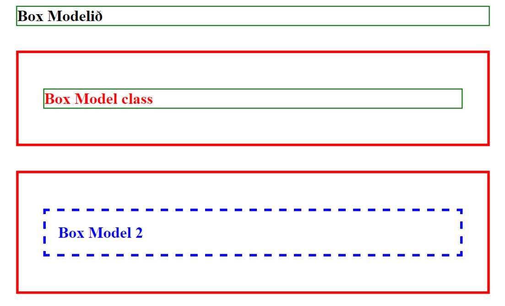
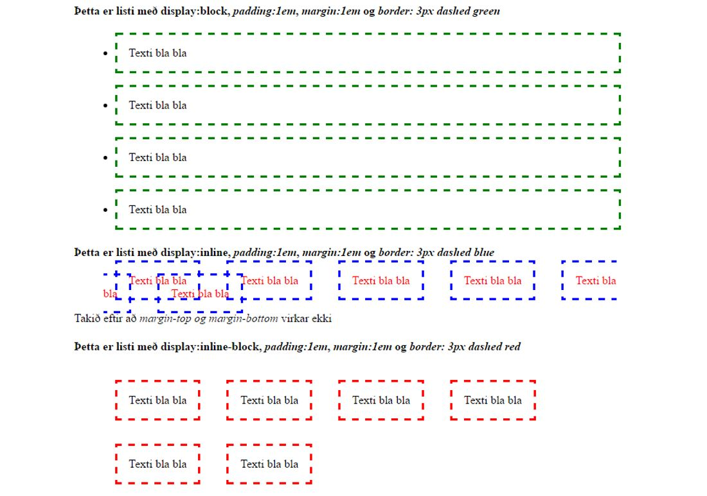
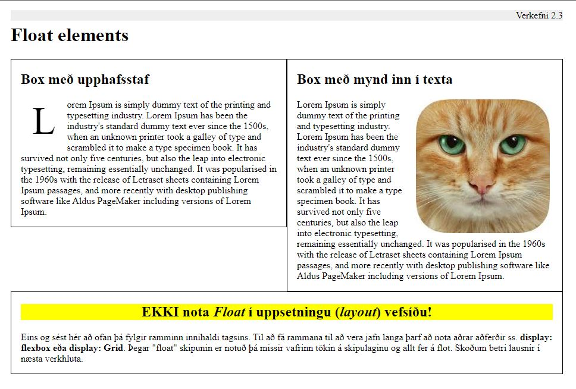

# HTML og CSS

### Markmið:

Nemendur eiga að öðlast skilning á hvað HTML ívafsmálið stendur fyrir og hvernig hægt er að stjórna útliti vefsíðu með CSS stílsíðu. Hvernig box módelið virkar og hvaða áhrif _display:_ eigindið hefur á tög.

### Verkefnalýsing

**2.1** Búðu til HTML vefsíðu og **notaðu efni sem þú hefur valið í 1. verkefni**. Settu viðeigandi HTML tög utan um textann, vandaðu frágang og notaðu tab lykilinn á lyklaborðinu til að búa til viðeigandi bil í HTML kóðann.  Notaðu viðeigandi tög til að gera textann læsilegan. Settu inn amk. einn tengil sem vísar á aðra vefsíðu og notaðu huldu klasa (_pseudo class_) til að sýna hvort tengillin hefur verið opnaður eða ekki. 

```
<H1> til <H6>, <p>, <em>, <strong>, <sub>, <sup>, <ul>, <ol>, <li>, <pre>, <br>, <hr> og <span> 
```
Búðu til stílsíðu (Cascading Style Sheet) og tengdu hana við html síðuna. Settu stíla á tögin.  Heildarbreidd vefsíðunnar getur verið **80em** (1280px) og hún á að vera miðjusett í skjáum sem eru stærri en 80em. Þú notar eigin texta og setur huldu klasa (_pseudo class_) á **A** tagið.
```
color:; text-decoration:; font-family:; font-style:; font-weight:; border:; margin:; padding:;  :link, :visited, :active, :hover  
```
- [**Sýnidæmi**](https://vefgrunnur.github.io/synidaemi/verkefni-2/)
  
### 2.2 Box módelið

Skrifaðu 3 línur af texta og settu þær í fyrirsagnarletur &lt;H1>. Stílaðu textann eins og sýnt er hér á myndinni



> H1 - padding - border - margin

### 2.21 Display

Eiginleikar taga (_Display settings_). Búðu til lista &lt;UL> í html síðu og breyttu eiginleikum listans með CSS "display" skipuninni eins og sýnt er hér á myndinni.
   

### 2.3 CSS "_Float_"

Búðu til vefsíðu inniheldur „dummy“ texta sem þú átt að fjölfalda og raða upp eins og sýnt er hér á myndinni.

Eigindi sem m.a. eru notuð í stílsíðu eru `float:left, border og padding `

### 2.4 Display Flexbox

Meðfylgjandi verkefni 2 er þjöppuð skrá (.zip) með HTML og CSS síðu. [Náðu í hana hér](verkefni-23-24/verkefni-nemar.zip) 

- Síðan lítur svona út þegar þú opnar hana í vafra 
- Breyttu efri röðinni (Row order) þannig að dálkarnir séu í einni **röð, gulur, rauður, grænn og blár**. 

- Það gerir þú með því að nota eftirfarandi stillingar:
  - display: flex;
  - flex-flow: row-reverse;
- Textinn í dálkunum á að vera **í miðju** dálkana. 
 


- Einnig á að breyta neðri röðinni  eins og sýnt er hér


### Námsefni

- [Box módelið](Box-model/)
- Eiginleikar taga (_Display settings_)

### Námsmat 12%

- 2.1 Eigin uppsetning
  - HTML síða" 3% 
  - CSS stílsíða - "a:_pseudo classes_" 3%
- 2.2 Box módelið og "_display_" stillingar  2%
- 2.3 Display: float 2%
- 2.4 Display: flex 2%

#### Skil

Vefsíðum og stílsíðum er skilað í Innu/VEFÞ1VG/**Verkefni-2**. 

> Athugið að sýnidæmi eru ekki metin til einkunnar

#### Einkunn verður birt í Innu
