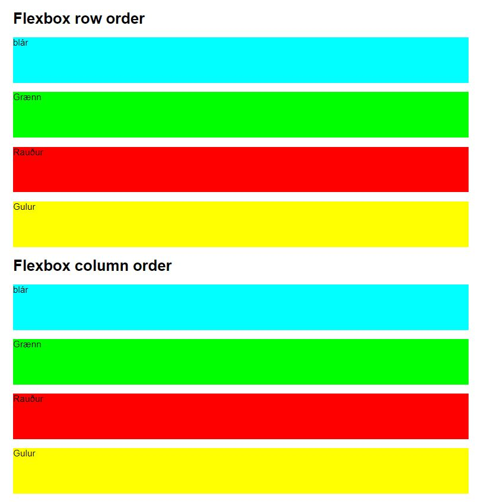
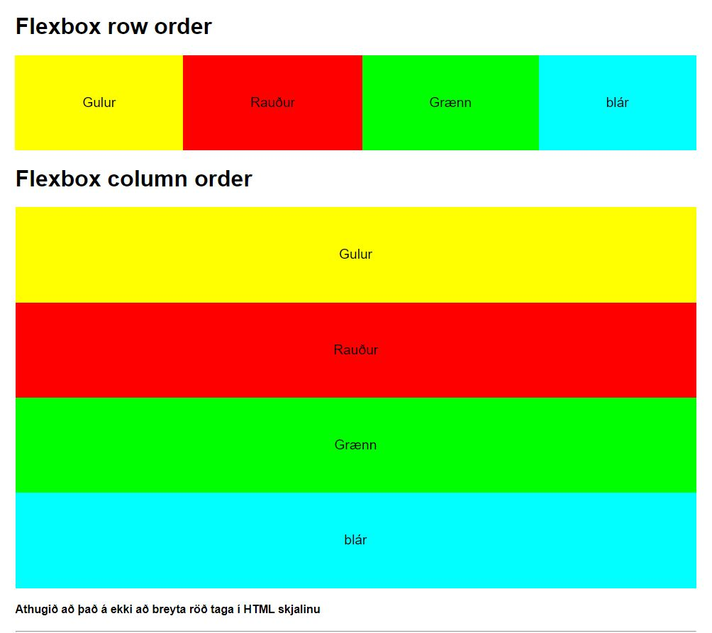

> Nýtt flexbox

# Skipulag vefsíðu með Grid Layout og Flex

### Markmið:

- Nemendur endurraða tögum með Flex stílum
- Nemendur hanna skipulag (_layout_) vefsíðu með CSS grid stílum
- Nemendur nota mismunandi tög fyrir mismunandi hluta vefsíðu (HTML5 Semantics)
- Nemendur setja upp vefsíðu og vinna eftir eigin skipulagi

### 3.1 Display Flexbox

> Meðfylgjandi verkefni 3 er þjöppuð skrá (.zip) með HTML og CSS síðu. [Náðu í hana hér](Namsefni-3/verkefni-nemar.zip) 

- Síðan lítur svona út þegar þú opnar hana í vafra 
- Breyttu efri röðinni (Row order) þannig að dálkarnir séu í einni **röð, gulur, rauður, grænn og blár**. 
- Það gerir þú með því að nota eftirfarandi stillingar:
  - display: flex;
  - flex-flow: row-reverse;
- Neðri röðin á að vera lóðrétt röð
- Textinn í dálkunum á að vera **í miðju** dálkana
 

---

### 3.2 Grid dálkar 

Búðu til HTML vefsíðu og tengdu hana við css skrá.  Búðu til 2 dálka uppsetningu, 3 dálka uppsetningu og 4 dálka uppsetningu. 

- Notaðu css skipunina **display: grid**
- [**Sýnidæmi**](https://vefgrunnur.github.io/synidaemi/verkefni-3/verkefni-31/)

### Hér eru sýnidæmi um skipulag vefsíðu: 

  - [**Grid skipulag**](Namsefni-3/Grid/Readme.md)

### Námsefni

* [Css-tricks](https://css-tricks.com/snippets/css/complete-guide-grid/)
* [Gridbyexample](https://gridbyexample.com/examples/)

### Námsmat 

- **3.1 Æfing, dálkar með grid 2%** 
  - col-2, col-3 og col-4
- **3.2 Eigið Grid skipulag / layout 10%**
  - Vefsíða sett upp í HTML5 rithætti - (_Semantics_) með eigin CSS grid skipulagi
  - `header` `nav` `main` `section` `article` `aside` `footer`
  - **Texti notaður sem þú hefur samið og skipulagt** (_þema kvikmyndir_) 
  
#### Skil

Verkþáttum er skilað í  **Innu/VEFÞ1VG/Verkefni 3** /Verkefni-31 og Verkefni-32

> Sýnidæmin eru ekki metin til einkunnar

#### Einkunn verður birt í Innu
